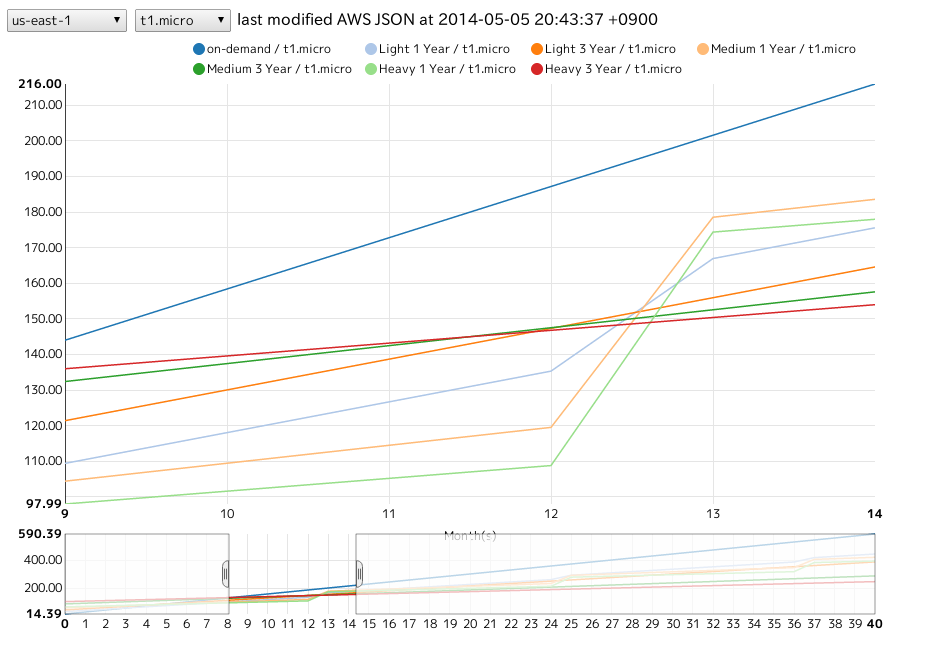

# Usage

1. Install [browserify](http://browserify.org/).
2. `./fetch-json.bash` to fetch AWS price info JSON.
3. `browserify src/* -o bundle.js` (My lazy file watching is `watch -n 1 browserify src/* -d -o bundle.js`)
4. Run http server e.g. `python -m SimpleHTTPServer 9909`, `python3 -m http.server 9909`, `ruby -run -e httpd -- --port=9909 .`, etc.
5. Open http://localhost:9909/ by your browser.

